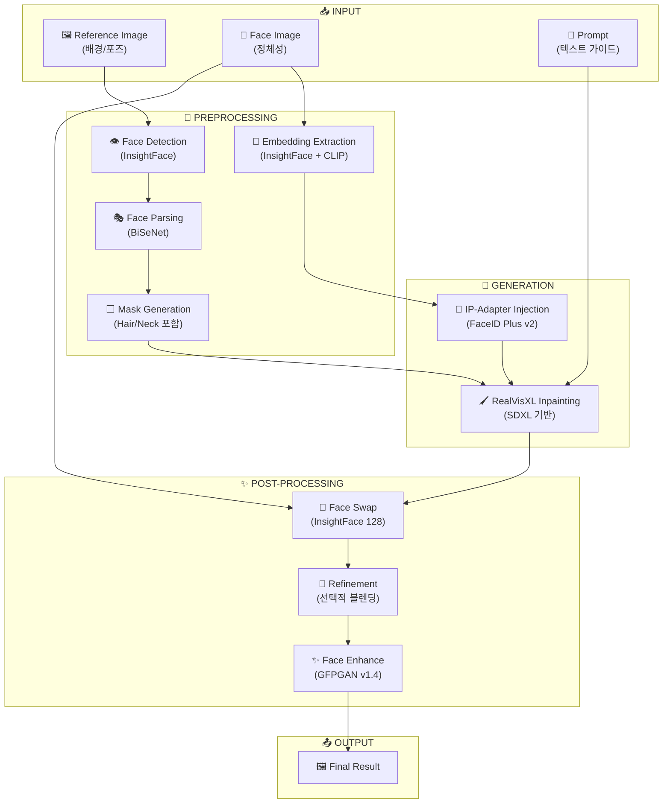

# Face Inpainting Pipeline Diagram

## 현재 파이프라인 구조 (Mermaid)

아래 다이어그램을 Figma에서 포스터용으로 디자인할 때 참고하세요.



## 단계별 상세 설명

### 1. INPUT (입력)
| 입력 | 설명 |
|------|------|
| Reference Image | 배경과 포즈를 제공하는 기준 이미지 |
| Face Image | 합성할 얼굴의 정체성을 담은 이미지 |
| Prompt | 텍스트 가이드 (선택적, Gemini 자동 생성 가능) |

### 2. PREPROCESSING (전처리)
| 단계 | 모델 | 역할 |
|------|------|------|
| Face Detection | InsightFace (buffalo_l) | 얼굴 위치 및 랜드마크 감지 |
| Face Parsing | BiSeNet | 얼굴 영역 세그멘테이션 (피부, 눈, 코, 입, 머리카락, 목) |
| Mask Generation | - | 인페인팅 영역 정의 (확장, 블러, 패딩 적용) |
| Embedding Extraction | InsightFace + CLIP | 512D 얼굴 임베딩 + 257x1280 이미지 임베딩 |

### 3. GENERATION (생성)
| 단계 | 모델 | 역할 |
|------|------|------|
| IP-Adapter Injection | FaceID Plus v2 | 얼굴 임베딩을 SDXL 어텐션 레이어에 주입 |
| Inpainting | RealVisXL V4.0 | 마스크 영역 재생성 (배경 보존) |

### 4. POST-PROCESSING (후처리)
| 단계 | 모델 | 역할 | 기본값 |
|------|------|------|--------|
| Face Swap | InsightFace (inswapper_128) | 생성된 얼굴을 소스 얼굴로 교체 | On |
| Refinement | RealVisXL (재사용) | Face Swap 경계 블렌딩 | Off |
| Face Enhance | GFPGAN v1.4 | 얼굴 화질 향상/복원 | On |

### 5. OUTPUT (출력)
- 최종 합성 결과 이미지
- WebSocket을 통한 실시간 진행 상황 업데이트

---

## 포스터용 간단 버전

```
┌─────────────────────────────────────────────────────────────────────────┐
│                              IP-to-Portrait                              │
├─────────────────────────────────────────────────────────────────────────┤
│                                                                          │
│   ┌──────────┐   ┌──────────┐   ┌──────────┐                            │
│   │ Reference│   │   Face   │   │  Prompt  │                            │
│   │  Image   │   │  Image   │   │  (Text)  │                            │
│   └────┬─────┘   └────┬─────┘   └────┬─────┘                            │
│        │              │              │                                   │
│        ▼              ▼              │                                   │
│   ┌─────────────────────────────┐    │                                   │
│   │      PREPROCESSING          │    │                                   │
│   │  ┌─────────┐ ┌──────────┐  │    │                                   │
│   │  │  Face   │ │   Face   │  │    │                                   │
│   │  │Detection│→│ Parsing  │  │    │                                   │
│   │  └────┬────┘ └────┬─────┘  │    │                                   │
│   │       │           │         │    │                                   │
│   │       ▼           ▼         │    │                                   │
│   │  ┌─────────┐ ┌──────────┐  │    │                                   │
│   │  │  Mask   │ │Embedding │  │    │                                   │
│   │  │Generate │ │ Extract  │  │    │                                   │
│   │  └────┬────┘ └────┬─────┘  │    │                                   │
│   └───────│───────────│────────┘    │                                   │
│           │           │             │                                   │
│           ▼           ▼             ▼                                   │
│   ┌─────────────────────────────────────┐                               │
│   │           GENERATION                 │                               │
│   │  ┌──────────────┐ ┌──────────────┐  │                               │
│   │  │  IP-Adapter  │→│   RealVisXL  │  │                               │
│   │  │  FaceID+v2   │ │  Inpainting  │  │                               │
│   │  └──────────────┘ └──────┬───────┘  │                               │
│   └──────────────────────────│──────────┘                               │
│                              │                                           │
│                              ▼                                           │
│   ┌─────────────────────────────────────┐                               │
│   │         POST-PROCESSING              │                               │
│   │  ┌──────────┐ ┌──────────┐ ┌──────┐│                               │
│   │  │Face Swap │→│Refinement│→│Enhance││                               │
│   │  │InsightFace│ │(Optional)│ │GFPGAN ││                               │
│   │  └──────────┘ └──────────┘ └──────┘│                               │
│   └─────────────────────┬───────────────┘                               │
│                         │                                                │
│                         ▼                                                │
│                  ┌──────────┐                                            │
│                  │  OUTPUT  │                                            │
│                  │  Result  │                                            │
│                  └──────────┘                                            │
│                                                                          │
└─────────────────────────────────────────────────────────────────────────┘
```

---

## 색상 권장 (포스터용)

| 섹션 | 색상 권장 |
|------|----------|
| INPUT | 🟦 파란색 계열 |
| PREPROCESSING | 🟨 노란색 계열 |
| GENERATION | 🟩 초록색 계열 |
| POST-PROCESSING | 🟪 보라색 계열 |
| OUTPUT | 🟥 빨간색/주황색 계열 |

---

## Figma 디자인 시 포함할 내용

1. **각 단계별 모델명** 표시
2. **화살표로 데이터 흐름** 표시
3. **POST-PROCESSING 섹션 강조** (새로 추가된 부분)
4. **Face Swap → Refinement → Enhance** 순서 명확히
5. 규격: 기존 `face-inpainting-pipeline.png`와 동일
