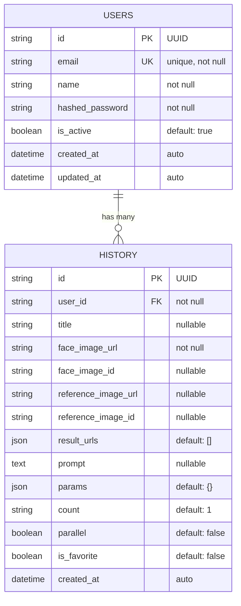

# Database ERD - Diffusion Planet

## Mermaid ERD Diagram



## Table Details

### users
| Column          | Type         | Constraints                    |
|-----------------|--------------|--------------------------------|
| id              | VARCHAR(255) | PRIMARY KEY, UUID              |
| email           | VARCHAR(255) | UNIQUE, NOT NULL, INDEX        |
| name            | VARCHAR(255) | NOT NULL                       |
| hashed_password | VARCHAR(255) | NOT NULL                       |
| is_active       | BOOLEAN      | DEFAULT TRUE                   |
| created_at      | TIMESTAMP    | DEFAULT CURRENT_TIMESTAMP      |
| updated_at      | TIMESTAMP    | ON UPDATE CURRENT_TIMESTAMP    |

### history
| Column             | Type         | Constraints                         |
|--------------------|--------------|-------------------------------------|
| id                 | VARCHAR(255) | PRIMARY KEY, UUID                   |
| user_id            | VARCHAR(255) | NOT NULL, FK -> users.id, INDEX     |
| title              | VARCHAR(255) | NULLABLE                            |
| face_image_url     | VARCHAR(500) | NOT NULL                            |
| face_image_id      | VARCHAR(255) | NULLABLE                            |
| reference_image_url| VARCHAR(500) | NULLABLE                            |
| reference_image_id | VARCHAR(255) | NULLABLE                            |
| result_urls        | JSON         | DEFAULT []                          |
| prompt             | TEXT         | NULLABLE                            |
| params             | JSON         | DEFAULT {}                          |
| count              | VARCHAR(255) | DEFAULT '1'                         |
| parallel           | BOOLEAN      | DEFAULT FALSE                       |
| is_favorite        | BOOLEAN      | DEFAULT FALSE                       |
| created_at         | TIMESTAMP    | DEFAULT CURRENT_TIMESTAMP           |

## Relationships

- **users -> history**: One-to-Many (CASCADE DELETE)
  - One user can have many history items
  - When a user is deleted, all their history items are deleted

## params JSON Structure

```json
{
  "prompt": "string",
  "seed": -1,
  "steps": 50,
  "guidance_scale": 7.5,
  "denoise_strength": 0.92,
  "face_strength": 0.85,
  "stop_at": 1.0,
  "adapter_mode": "faceid_plus",
  "face_blend_weight": 0.6,
  "hair_blend_weight": 0.4,
  "mask_blur": 15,
  "mask_expand": 0.3,
  "mask_padding": 0,
  "include_hair": true,
  "include_neck": false,
  "auto_prompt": false
}
```
